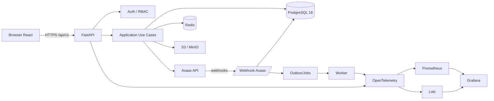

# 00 — Arquitetura do sistema

## 1. Visão

A plataforma será uma aplicação web dividida em quatro zonas:

1. **Pública** — landing page, catálogo, página de curso, professor, autenticação e checkout.
2. **Aluno** — consumo das aulas, progresso, avaliações, certificados, compras e perfil.
3. **Professor** — autoria de cursos, módulos, aulas, avaliações, acompanhamento e publicação.
4. **Administração/Operações** — usuários, cursos, pagamentos, logs, webhooks, jobs, saúde, métricas e manutenção.

## 2. Diagrama de alto nível



## 3. Fronteiras arquiteturais

Cada módulo deve manter quatro responsabilidades claras:

```text
module/
├─ domain/           # entidades, value objects e contratos; zero FastAPI/SQLAlchemy
├─ application/      # casos de uso; orquestra regras
├─ infrastructure/   # SQLAlchemy, Asaas, storage, Redis
└─ interface/        # HTTP/FastAPI, schemas e dependencies
```

### Dependências permitidas

```text
interface -> application -> domain
infrastructure -> domain
bootstrap/main -> interface + infrastructure
```

`domain` não importa FastAPI, SQLAlchemy, Redis, Asaas ou Pydantic de transporte.

## 4. Módulos de negócio

```text
identity
profiles
courses
authoring
learning
assessments
enrollments
payments
subscriptions       # opcional se houver planos recorrentes
certificates
reviews
notifications
lives               # opcional
media
admin
observability
```

A API atual já possui vários equivalentes. A estratégia é migrá-los verticalmente.

## 5. Backend

### Componentes base

- FastAPI para HTTP/OpenAPI.
- Pydantic para boundary validation.
- SQLAlchemy 2 async + `asyncpg`.
- Alembic como **única** fonte de mudança de esquema.
- `httpx.AsyncClient` como cliente Asaas.
- Redis para cache, rate limiting distribuído e coordenação de jobs quando necessário.
- Worker separado para vídeo e tarefas demoradas.

### Regra de concorrência

Não executar clientes síncronos dentro de `async def`. O backend antigo possui dívida técnica nesse ponto. A nova infraestrutura deve ser async de ponta a ponta sempre que a biblioteca permitir.

## 6. Frontend

O frontend usa React com áreas autenticadas lazy-loaded. Rotas públicas de aquisição seguem contrato HTML-first (SSR/SSG/prerender) conforme `docs/25-SEO-ARQUITETURA-PUBLICA.md`; dashboards autenticados podem operar como SPA.

```text
src/
├─ app/                # router, providers, bootstrap
├─ features/
│  ├─ auth/
│  ├─ catalog/
│  ├─ checkout/
│  ├─ student/
│  ├─ teacher/
│  └─ admin/
├─ shared/
│  ├─ api/
│  ├─ components/
│  ├─ hooks/
│  ├─ schemas/
│  └─ utils/
└─ styles/
```

**Server state** fica no TanStack Query. Zustand é permitido somente para estado de interface/client local que não pertence ao servidor.

## 7. Autenticação sugerida

Sem Supabase Auth, utilizar autenticação própria com PostgreSQL:

- senha com Argon2id;
- access token JWT curto, por exemplo 10–15 min;
- refresh token criptograficamente aleatório, rotativo, armazenado **como hash** no banco;
- refresh em cookie `HttpOnly`, `Secure` e `SameSite` apropriado;
- revogação por sessão/dispositivo;
- reset de senha por token de uso único e validade curta;
- verificação de e-mail opcional/obrigatória conforme política;
- MFA para `admin` e `super_admin` **obrigatório em produção**.

### Papéis

- `student`
- `teacher`
- `admin`
- `super_admin`

RBAC determina capacidade geral. Ownership/ABAC determina se o professor é dono do recurso.

Exemplo: possuir `teacher` **não** permite editar curso de outro professor.

## 8. Pagamento

Use uma interface de domínio:

```python
class PaymentGateway(Protocol):
    async def ensure_customer(...): ...
    async def create_checkout(...): ...
    async def get_payment(...): ...
```

Implementação concreta:

```text
infrastructure/payments/asaas_gateway.py
```

Isso permite trocar Asaas sem contaminar casos de uso.

## 9. Dados financeiros

Nunca armazenar dinheiro em `float`.

Use:

```text
price_cents BIGINT
subtotal_cents BIGINT
discount_cents BIGINT
total_cents BIGINT
```

E preserve snapshots no pedido para que alterações futuras no preço do curso não alterem compras antigas.

## 10. Eventual consistency

Pagamentos e processamento de vídeo são assíncronos. A interface deve aceitar estados como:

```text
pending -> paid
pending -> expired
paid -> refunded
paid -> chargeback
queued -> processing -> completed/failed
```

Não modele esses fluxos como se toda operação terminasse em uma única request.

## 11. Padrão Outbox

Para eventos críticos — pagamento aprovado, matrícula criada, certificado emitido — registre a mudança e um `outbox_event` na mesma transação PostgreSQL. Um worker publica/processa o evento depois.

Isso evita o cenário “banco confirmou, mas a notificação/job falhou no meio”.

## 12. ADRs obrigatórios

Mudanças importantes devem gerar Architecture Decision Records:

- ADR-001: Modular Monolith + Ports/Adapters.
- ADR-002: PostgreSQL + SQLAlchemy async.
- ADR-003: autenticação e sessões revogáveis.
- ADR-004: Asaas e webhook como fonte financeira.
- ADR-005: object storage privado.
- ADR-006: outbox/jobs.
- ADR-007: rendering público/SEO.
- ADR-008: observabilidade.
- ADR-009: RBAC + ownership/ABAC.
- ADR-010: design system + acessibilidade.


## 13. Baselines executáveis

- architecture tests: `docs/26-ARCHITECTURE-TESTS-SOLID.md`;
- security: `docs/20-SECURITY-BASELINE-ASVS.md`;
- quality gates: `docs/21-QUALITY-GATES.md`;
- migration policy: `docs/22-DATABASE-MIGRATION-POLICY.md`;
- capacity/performance: `docs/23-PERFORMANCE-CAPACITY-MODEL.md`;
- failure modes: `docs/24-RESILIENCIA-E-FAILURE-MODES.md`.
