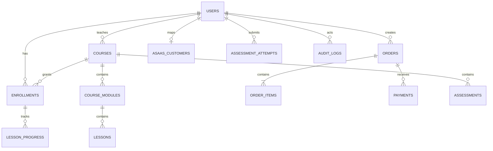

# 02 — PostgreSQL e modelo de dados

> **Banco oficial:** `ICIBINA` (`ICIBINA_test` no CI). Schema aplicado pela aplicação vem de SQLAlchemy + Alembic; MCP PostgreSQL é read-only.

## Princípios

- UUID como identificador público.
- `TIMESTAMPTZ` para datas de negócio e auditoria.
- dinheiro em centavos `BIGINT`.
- `JSONB` somente para payloads/eventos/configuração variável; não substituir modelagem relacional.
- foreign keys reais.
- unique constraints como proteção de invariantes.
- índices criados a partir do padrão de acesso, não “em todas as colunas”.
- soft delete somente quando houver requisito de recuperação/auditoria; não aplicar automaticamente em tudo.

## Domínios de tabelas

### Identidade

```text
users
user_profiles
refresh_sessions
roles
user_roles
password_reset_tokens
email_verification_tokens
```

### Cursos

```text
courses
course_modules
lessons
lesson_resources
course_reviews
course_prerequisites
```

### Aprendizagem

```text
enrollments
lesson_progress
course_progress_snapshots
assessments
assessment_questions
assessment_options
assessment_attempts
assessment_answers
certificates
```

### Financeiro

```text
asaas_customers
orders
order_items
payments
payment_webhook_events
subscriptions        # somente se o produto usar recorrência
```

### Operação

```text
notifications
audit_logs
outbox_events
system_settings
maintenance_events
background_jobs
video_processing_jobs
```

## Relacionamentos principais



## Matrícula

`enrollments` representa autorização para estudar um curso. Não derive acesso consultando o pagamento a cada página.

Campos importantes:

```text
status: active | suspended | revoked | completed
source: purchase | subscription | admin | scholarship
starts_at
ends_at nullable
order_id nullable
```

Refund/chargeback pode atualizar `enrollment.status` conforme política comercial.

## Pedido como snapshot

`order_items` deve preservar:

```text
course_id
course_title_snapshot
unit_price_cents
quantity
subtotal_cents
```

Isso protege histórico financeiro quando o curso muda de nome/preço.

## Webhook idempotente

`payment_webhook_events.event_id` precisa ser `UNIQUE`. A estratégia canônica é **inbox/outbox + worker**, conforme `docs/03-ASAAS-PAGAMENTOS.md`.

Request do provider:

```text
BEGIN
INSERT evento bruto/minimizado ... ON CONFLICT DO NOTHING
se duplicado: COMMIT -> 2xx
cria outbox/job de processamento
COMMIT
HTTP 2xx rápido
```

Depois, o worker aplica a state machine financeira e cria/revoga matrícula em transação curta e idempotente. **Não** manter o webhook do Asaas aberto enquanto executa toda a regra de negócio.

## Índices iniciais

Priorize:

- `users(lower(email)) UNIQUE`;
- `courses(slug) UNIQUE`;
- `courses(teacher_id, status)`;
- `lessons(module_id, position)`;
- `enrollments(user_id, status)`;
- `enrollments(user_id, course_id) UNIQUE`;
- `orders(user_id, created_at DESC)`;
- `orders(status, created_at)`;
- Asaas checkout/payment IDs únicos quando presentes;
- `payment_webhook_events(event_id) UNIQUE`;
- `payment_webhook_events(status, received_at)`;
- `audit_logs(created_at DESC)` e `(actor_user_id, created_at DESC)`;
- jobs `(status, run_at)`.

## Performance

Ative `pg_stat_statements` em ambientes onde o provedor permitir e monitore:

- query média/p95;
- chamadas;
- shared blocks read/hit;
- temp files;
- locks;
- conexões;
- deadlocks;
- bloat/autovacuum.

Toda otimização de índice deve ser comprovada com `EXPLAIN (ANALYZE, BUFFERS)` em staging com dados representativos.

## Pool

Use pool pequeno e calculado. Exemplo conceitual:

```text
API replicas * pool_size + workers * pool_size < max_connections com margem
```

Nunca resolver lentidão apenas aumentando conexões.

## SQL inicial

Veja `database/001_initial_schema.sql`. Ele é uma **baseline de projeto**, não substitui migrations Alembic finais.

## Worker concorrente

Se `background_jobs`/outbox forem consumidos no PostgreSQL, use claim atômico com `FOR UPDATE SKIP LOCKED`, lease/heartbeat e limite de tentativas. Redis não deve virar uma segunda fonte de verdade para job crítico sem ADR.

Inicialmente:

```text
PostgreSQL/outbox = durabilidade e verdade do job/evento
Redis = cache/rate limit/coordenação efêmera
```

## Compatibilidade de schema

Mudança incompatível usa expand/contract e precisa passar dois cenários em CI:

1. banco vazio -> `alembic upgrade head`;
2. snapshot da versão anterior -> `alembic upgrade head` -> smoke/integration.


## Extensões para medicina integrativa

Governança científica/editorial e credenciais estão especificadas em `docs/28-EXTENSOES-DOMINIO-MEDICINA-INTEGRATIVA.md` e no blueprint `database/002_medical_education_extensions.sql`. Converter para Alembic na implementação; não aplicar SQL de referência manualmente em produção.
