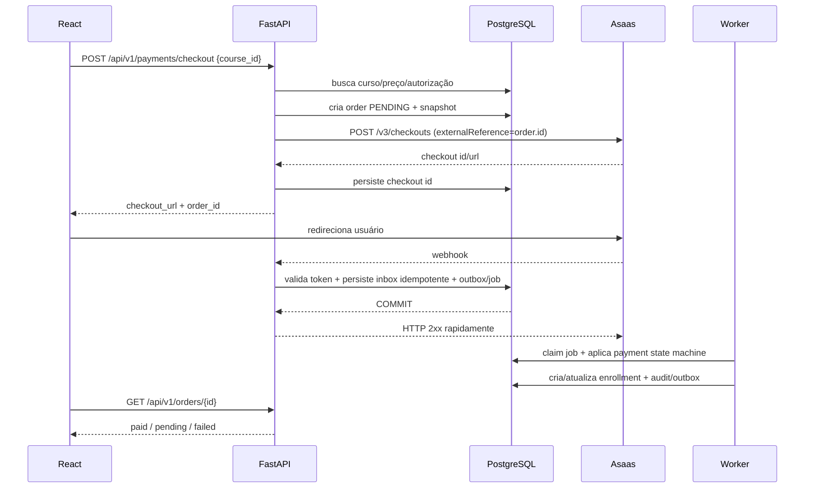

# 03 — Integração Asaas

## Estratégia recomendada

Para reduzir exposição a dados de cartão, usar **Asaas Checkout hospedado** para PIX e cartão quando ele atender ao fluxo comercial. O frontend solicita um checkout ao backend, recebe a URL/sessão e redireciona o usuário.

A confirmação financeira vem de **webhook**, nunca do `successUrl`/callback do navegador.

## Ambientes

```text
Sandbox:    https://api-sandbox.asaas.com/v3
Produção:   https://api.asaas.com/v3
```

Use `access_token` somente no backend.

## Fluxo de compra



## Endpoint interno

### POST `/api/v1/payments/checkout`

Entrada mínima:

```json
{
  "course_id": "uuid-do-curso"
}
```

Nunca aceite do frontend:

```json
{
  "price": 10.00,
  "paid": true,
  "teacher_id": "...",
  "enrollment": "active"
}
```

O backend busca preço e produto no PostgreSQL.

Resposta:

```json
{
  "order_id": "...",
  "status": "pending",
  "checkout_url": "https://asaas.com/checkoutSession/show?id=..."
}
```

## Cliente Asaas

```python
class AsaasClient:
    def __init__(self, base_url: str, api_key: str, http: httpx.AsyncClient):
        self.base_url = base_url
        self.api_key = api_key
        self.http = http

    async def request(self, method: str, path: str, *, json=None):
        response = await self.http.request(
            method,
            f"{self.base_url}{path}",
            headers={
                "access_token": self.api_key,
                "Content-Type": "application/json",
                "User-Agent": "course-platform/1.0",
            },
            json=json,
            timeout=15.0,
        )
        response.raise_for_status()
        return response.json()
```

Adicionar retries **somente** em erros transitórios e de maneira consciente de idempotência. Nunca repetir `POST` financeiro cegamente.

## Customer mapping

Mantenha uma tabela `asaas_customers` por usuário. O Asaas permite criar clientes duplicados, então a plataforma deve impor unicidade local.

Use `externalReference` com o UUID interno sempre que o endpoint permitir.

## Webhook

Endpoint:

```text
POST /api/v1/webhooks/asaas
```

Requisitos:

1. validar o token enviado no header `asaas-access-token` conforme a configuração do webhook;
2. nunca usar a API key como webhook auth token;
3. limitar tamanho do body;
4. parsear JSON de forma segura;
5. persistir `event.id` com unique constraint;
6. responder `2xx` rapidamente;
7. processar efeitos pesados fora do request;
8. aceitar entrega `at least once` — duplicatas são normais;
9. registrar falha sem vazar dados sensíveis.

O token de autenticação de webhook configurado no Asaas deve ter alta entropia e ficar apenas no secret manager/`.env` local.

## Eventos e liberação de acesso

Se usar checkout hospedado, trate o evento de checkout pago e vincule aos eventos financeiros necessários. Para integrações diretas de cobrança, a política pode depender do método:

- PIX: prefira liberação após evento financeiro que represente recebimento; a documentação do Asaas alerta que alguns estados podem sofrer bloqueio/estorno posterior.
- cartão: `PAYMENT_CONFIRMED` pode representar pagamento concluído antes da disponibilização financeira; se a política do produto liberar nesse ponto, monitore refund/chargeback posteriormente.
- boleto: normalmente liberação após recebimento.

**A política exata deve ser testada no sandbox para cada método habilitado.**

Eventos reversos devem suspender/revogar acesso conforme regra comercial:

```text
PAYMENT_REFUNDED
PAYMENT_CHARGEBACK_REQUESTED / chargeback-related events
```

Não exclua histórico de matrícula; altere status e audite.

## Callback/success page

A página de sucesso é apenas UX:

```text
/pagamento/processando?order=<uuid>
```

Ela faz polling/query refetch:

```text
GET /api/v1/orders/{order_id}
```

e mostra:

```text
pending -> "Estamos confirmando seu pagamento"
paid    -> "Acesso liberado"
failed  -> mensagem e ação
expired -> novo checkout
```

Nunca transforme query string `?success=true` em matrícula.

## Idempotência

Três chaves diferentes:

1. `order.id` interno — identidade da compra;
2. ID do checkout/pagamento Asaas — identidade no provider;
3. `webhook event.id` — identidade da entrega/evento.

Todas devem ter constraints de unicidade onde aplicável.

## Reconciliação

Crie job administrativo para buscar pedidos `pending` antigos e reconciliar com Asaas. Isso não substitui webhook; é rede de segurança.

No admin:

```text
Financeiro > Reconciliação
```

Ações:

- visualizar divergência;
- consultar Asaas novamente;
- reprocessar evento já armazenado;
- nunca editar status para “pago” manualmente sem trilha de auditoria e permissão forte.

## Assinaturas

Se vender plano recorrente, modele subscription local separadamente. Criar uma assinatura no Asaas agenda cobranças; acesso deve acompanhar eventos de pagamento, cancelamento e inadimplência, não apenas existência da subscription.

## Segredos

```env
ASAAS_BASE_URL=https://api-sandbox.asaas.com/v3
ASAAS_API_KEY=$aact_...
ASAAS_WEBHOOK_TOKEN=token-aleatorio-longo
```

Nunca prefixar com `VITE_`.

## Webhook inbox — regra operacional final

O endpoint HTTP deve fazer o mínimo síncrono necessário:

```text
validar authToken/header
-> parse tolerante a campos novos
-> persistir inbox event UNIQUE(provider,event_id) em transação curta
-> criar sinal/job/outbox na mesma transação
-> COMMIT
-> HTTP 200
```

O worker aplica transições financeiras/matrícula depois. Assim, falha de regra de negócio não mantém a request do Asaas aberta e o evento já está preservado para retry/reprocessamento.

Não dependa da ordem de entrega. Uma transição antiga não pode rebaixar estado mais forte sem política explícita; em divergência relevante, reconcilie consultando o recurso atual no Asaas.

O parser de webhook deve ignorar atributos desconhecidos e validar apenas o conjunto necessário para cada evento, pois o provider pode adicionar novos campos.
