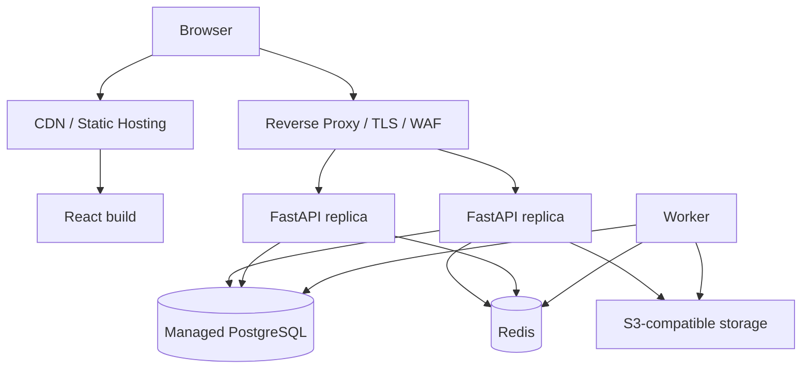

# 10 — Desenvolvimento e deployment

## Desenvolvimento local

Serviços:

```text
frontend
api
worker
postgres
redis
minio
```

Observabilidade pode ficar em profile Docker separado:

```text
prometheus
grafana
loki
otel-collector
```

Veja `docker-compose.target.yml` como referência.

## Produção

Arquitetura mínima:



## Banco

Preferir PostgreSQL gerenciado com:

- backups automáticos;
- PITR se disponível;
- TLS;
- private networking quando possível;
- métricas;
- manutenção de minor versions;
- restore testado.

Backup não testado não é estratégia de recuperação.

## Migration deploy

Pipeline:

```text
build/test
backup/restore readiness
alembic upgrade head (job único)
deploy API compatible
smoke test
release frontend
```

Para mudanças grandes use expand/contract:

```text
1. adiciona nova coluna/tabela sem quebrar versão atual
2. deploy código que escreve/lê compatível
3. backfill
4. muda leitura
5. remove legado em release posterior
```

## Asaas produção

Gate de produção:

- integração testada no sandbox;
- webhook HTTPS público;
- token de webhook rotacionável;
- secret manager;
- idempotência validada;
- alerta de webhook failure;
- reconciliação pronta;
- callbacks apontando para domínio final;
- política de refund/chargeback definida.

## CI/CD

Stages:

```text
lint
static typing
unit tests
integration tests
frontend tests
build images
security/dependency scan
migration check
deploy staging
E2E staging
manual/protected promotion production
smoke production
```

## Rollback

Código deve conseguir rollback independente de migrations destrutivas. Por isso migrations destrutivas não devem ocorrer no mesmo release que remove suporte ao schema antigo.

## Feature flags

Use para funções de risco:

```text
new_checkout
new_course_builder
admin_maintenance_actions
video_pipeline_v2
```

Flag não substitui autorização.

## Reprodutibilidade

Produção não deve depender de tags/pacotes flutuantes. Fixe runtime e gere lockfiles. Imagens usadas em release devem ser identificáveis por tag imutável ou digest.

## Disaster recovery

Defina RPO/RTO e faça restore drill periódico. O resultado do restore (tempo, integridade e smoke test) deve ser registrado; existência de backup sem teste não conta como recuperação validada.

Veja `docs/17-OPERATIONS-AND-RELEASE-RUNBOOK.md`.
