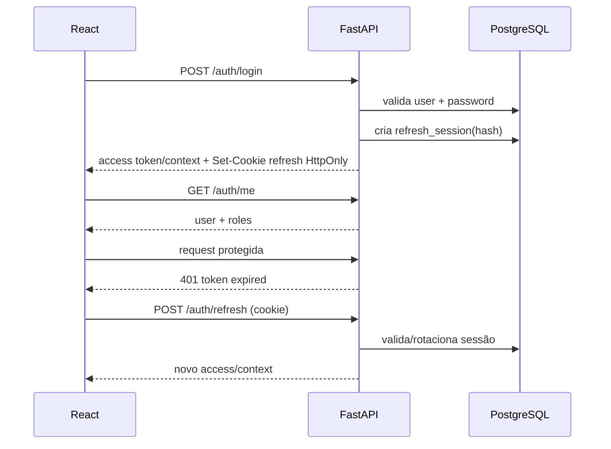

# 14 — Integração prática depois de colar `backend/` e `frontend/`

Este é o procedimento operacional para iniciar o projeto real.

## 1. Layout da raiz

Depois de extrair/copiar os projetos, deixe:

```text
project/
├─ backend/            # backend FastAPI atual
├─ frontend/           # React/Vite
├─ docs/
├─ .agents/skills/
├─ .env.example
└─ docker-compose.yml
```

Não coloque o frontend dentro de `backend/src` e não faça o FastAPI servir o código fonte React durante desenvolvimento.

## 2. Primeiro boot sem mexer em regra de negócio

Backend:

```powershell
cd backend
py -m venv .venv
.\.venv\Scripts\Activate.ps1
pip install -r requirements.txt
pytest -q
```

Frontend:

```powershell
cd frontend
npm install
npm run build
```

Registre o baseline antes da migração. Falha preexistente deve ser anotada, não escondida.

## 3. Criar branch de migração

Sugestão:

```text
chore/platform-postgres-asaas-foundation
```

Evite desenvolver a migração diretamente em `main`.

## 4. Instalar skills pelos CLIs nativos

Codex CLI:

```powershell
.\scripts\install-skills-codex.ps1
```

Antigravity 2.0 / Antigravity CLI:

```powershell
.\scripts\install-skills-antigravity.ps1
```

Ou execute o setup conjunto:

```powershell
.\scripts\install-agent-skills.ps1
```

O Codex registra o plugin ICIBINA por `codex plugin marketplace`; o Antigravity valida o pacote via `agy plugin install` e ativa a versão final apenas em `.agents/plugins/icibina-engineering`. Não use `npx skills` como mecanismo final de distribuição da ICIBINA. **UI/UX Pro Max** entra no plugin a partir do commit auditado e deve ser invocado pelo bridge `scripts/uiux-pro-max.py`. O upstream **`motiondivision/ai-kit` não é copiado para os plugins** enquanto estiver `reference-only/NOASSERTION`; animações usam `motion/react`, o orquestrador local `motion-experience-orchestrator` e o Motion MCP público. Motion+ continua opt-in.

O 21st CLI continua sendo runtime necessário para as skills 21st. Faça login quando o projeto realmente precisar consultar/instalar componentes:

```powershell
21st login
```

Valide o blueprint e, após instalação local, o runtime:

```powershell
python scripts\check-agent-cli-bundles.py --runtime
python scripts\check-frontend-agent-stack.py --strict
```

## 5. Ambiente local

Suba primeiro infraestrutura:

```powershell
# opcional: copie os defaults locais para .env e troque os segredos locais
cp config/.env.example .env  # PowerShell: Copy-Item config/.env.example .env
docker compose --env-file .env -f docker-compose.target.yml up -d postgres redis minio
```

Crie `.env` a partir de `config/.env.example` e troque secrets locais.

A chave Asaas deve ser do **sandbox**.

### PostgreSQL MCP read-only

Depois de criar o role `icibina_mcp_reader` conforme `docs/33-MCP-POSTGRESQL-ICIBINA.md`, configure o profile local:

```powershell
.\scripts\setup-postgres-mcp.ps1
.\scripts\check-postgres-mcp-runtime.ps1
```

Esse MCP é para inspeção/diagnóstico. Models SQLAlchemy + Alembic continuam sendo o único caminho de schema change.

## 6. Instalar nova infraestrutura no backend

Durante a migração, mantenha temporariamente deps antigas enquanto cada módulo ainda depende delas.

Adicione gradualmente:

```text
sqlalchemy[asyncio]
asyncpg
alembic
httpx
argon2-cffi
PyJWT
redis
structlog
OpenTelemetry libs
```

Não remova `supabase`/`stripe` até nenhum módulo importá-los.

## 7. Criar camada PostgreSQL

Estrutura sugerida:

```text
backend/src/core/database/
├─ engine.py
├─ session.py
└─ transaction.py

backend/alembic/
```

`engine.py`:

```python
from sqlalchemy.ext.asyncio import create_async_engine, async_sessionmaker

engine = create_async_engine(
    settings.database_url,
    pool_pre_ping=True,
    pool_size=settings.database_pool_size,
    max_overflow=settings.database_max_overflow,
)
SessionFactory = async_sessionmaker(engine, expire_on_commit=False)
```

Dependency de request abre sessão; casos de uso que precisam de atomicidade recebem unidade de trabalho/transação explícita. Não faça `commit()` dentro de cada repository aleatoriamente.

## 8. Alembic

Inicialize e gere uma baseline real baseada nos models aprovados. O arquivo `database/001_initial_schema.sql` deste pacote serve para modelagem/revisão, não deve substituir o histórico Alembic final.

Fluxo:

```text
model SQLAlchemy
-> alembic revision --autogenerate
-> revisar SQL gerado
-> aplicar em DB descartável
-> rodar integração
```

Nunca aceite migration autogenerate sem revisão.

## 9. CORS e URL da API

Desenvolvimento:

```text
frontend: http://localhost:5173
backend:  http://localhost:8000
```

Backend:

```text
ALLOWED_ORIGINS=http://localhost:5173
```

Frontend `.env.local`:

```text
VITE_API_URL=http://localhost:8000/api/v1
```

Somente informação pública pode usar prefixo `VITE_`. Nunca coloque Asaas API key ou JWT secret ali.

## 10. Cliente React

Um único client compartilhado deve:

- prefixar `VITE_API_URL`;
- usar `credentials: include` quando refresh/session usa cookie;
- mapear envelope de erros;
- propagar/request ID quando necessário;
- efetuar no máximo um refresh/retry por request;
- não fazer toast dentro da camada de transporte.

TanStack Query consome esse client.

## 11. Autenticação frontend ↔ backend

Fluxo:



A implementação pode optar por manter access token apenas em memória no browser ou por cookie seguro conforme threat model. Não persista refresh token em `localStorage`.

## 12. Role routing

Após `/auth/me`:

```text
student -> /aluno
teacher -> /professor
admin/super_admin -> /admin
```

Um usuário pode ter múltiplas roles. O frontend pode oferecer troca de contexto; o backend valida role por endpoint.

## 13. Compra React ↔ Asaas

Componente React chama apenas:

```text
POST /payments/checkout { course_id }
```

Backend:

```text
verifica curso publicado
verifica matrícula existente
busca price_cents
cria order + item snapshot
cria checkout no Asaas
salva asaas_checkout_id
retorna checkout_url
```

React redireciona para `checkout_url`.

Ao voltar do Asaas:

```text
/pagamento/processando?order=<uuid>
```

React consulta `GET /orders/<uuid>` usando refetch com limite/backoff. Somente quando API retornar `paid` a UI mostra acesso liberado.

## 14. Webhook Asaas

O webhook chega diretamente ao backend — **não passa pelo React**.

```text
Asaas -> webhook -> inbox/outbox -> HTTP 2xx -> worker -> payment/enrollment
```

Portanto o endpoint precisa estar acessível por HTTPS em staging/produção e usar autenticação de webhook.

No desenvolvimento local, use túnel apenas quando precisar testar entrega real do sandbox; não exponha admin/dev tools pelo túnel.

## 15. Integração de curso/aula

Frontend nunca recebe chave permanente do storage. Para conteúdo privado:

```text
React -> GET lesson
API valida enrollment
API retorna metadata + signed playback/download URL curta
```

Para vídeo processado, a URL/manifest deve expirar e o bucket fica privado.

## 16. Painel professor

Query keys devem ser separadas da área do aluno:

```text
['teacher','courses']
['teacher','course',id]
['teacher','course',id,'students']
```

Ao editar, envie `version`/ETag. Em `409`, mostre conflito e opção de recarregar; não sobrescreva silenciosamente.

## 17. Admin

O admin React nunca acessa Grafana/PostgreSQL diretamente com credencial de serviço. Para KPIs operacionais simples usa endpoints `/admin/ops/*`. Para investigação aprofundada, Grafana pode ser ferramenta separada com SSO/RBAC.

Não faça endpoint `/admin/sql` ou `/admin/run-command`.

## 18. Dev proxy opcional

Vite pode proxyar `/api` para FastAPI em dev. Isso simplifica CORS local, mas produção continua com topologia explícita.

Exemplo conceitual:

```ts
server: {
  proxy: {
    '/api': 'http://localhost:8000'
  }
}
```

Se usar proxy, `VITE_API_URL=/api/v1`.

## 19. Primeiro vertical slice recomendado

Implemente antes de tentar todos os dashboards:

```text
cadastro/login
-> lista pública de cursos PostgreSQL
-> professor cria curso
-> aluno compra curso via Asaas sandbox
-> worker processa webhook persistido e cria/atualiza enrollment
-> aluno abre primeira aula
-> admin enxerga pedido + webhook + audit log
```

Esse slice valida arquitetura inteira: React, auth, PostgreSQL, RBAC, Asaas, webhook, enrollment e admin.

## 20. Critério de integração concluída

Só considere frontend e API integrados quando:

```text
CORS/cookies funcionam em dev e staging
401 refresh não entra em loop
roles são respeitadas
BOLA tests passam
checkout não aceita preço do browser
webhook duplicado não duplica matrícula
refund/chargeback possui política
OpenAPI e types estão sincronizados
E2E cobre aluno/professor/admin
logs possuem request_id
admin mostra health sem expor secrets
```
